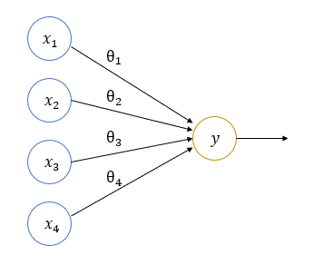
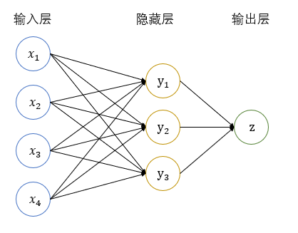
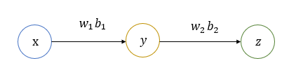
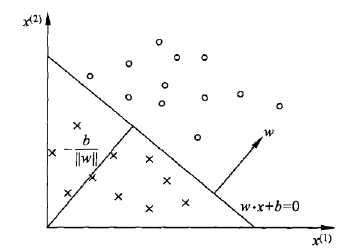

  
  
- [Ch1 前馈神经网络和感知机](#ch1-前馈神经网络和感知机 )
  - [前馈神经网络](#前馈神经网络 )
    - [单层前馈神经网络](#单层前馈神经网络 )
    - [多层前馈神经网络](#多层前馈神经网络 )
  - [BP神经网络](#bp神经网络 )
    - [反向传播](#反向传播 )
    - [梯度下降](#梯度下降 )
  - [感知机](#感知机 )
    - [感知机概述](#感知机概述 )
    - [感知机的数学模型](#感知机的数学模型 )
    - [感知机的几何解释](#感知机的几何解释 )
    - [感知机的学习过程](#感知机的学习过程 )
  
##  Ch1 前馈神经网络和感知机
  
先介绍最简单、最原始的神经网络——前馈神经网络的概念，再讲解前馈神经网络的训练过程——反向传播（BP）和梯度下降，最后通过简单的实例——感知机解释前馈神经网络的一种应用
  
###  前馈神经网络
  
  
每一层神经元接受前一层神经元的输出作为输入，并输出到下一层神经元。网络中无反馈，信号单向传播。单独一层可以抽象为一个线性函数。通过多个这样的层，可以实现输入空间到输出空间的复杂映射
  
####  单层前馈神经网络
  
不考虑激活函数， 为输入（input）， 为权重（weight）。通常  固定为 1，对应的  称为偏置项
  
- 图像表示

  
- 矩阵表示
 和  满足这样的关系式

  
  
表示为矩阵形式也就是

  
  
  
####  多层前馈神经网络
  
第零层称为输入层，最后一层称为输出层，中间其他层称为隐藏层
  
- 图像表示

  
- 矩阵表示
 和  满足这样的关系式

  
  
表示为矩阵形式也就是

  
  
 和  的关系与单层前馈神经网络相同
  
###  BP神经网络
  
用反向传播算法（BP）训练多层前馈神经网络，包括了信号前向传播和误差反向传播两个过程。BP 算法的指导思想是梯度下降（）
  
####  反向传播
  
通过链式法则计算损失函数对每一个参数的导数
  

  
根据前馈神经网络输入和输出的关系，我们可以得到这样的信息
  

  
  
  
假设损失函数是根据  定义的 ，为了找到能够最小化损失函数的参数  和 ，就需要求出  对  和  的偏导数来确定梯度下降的方向
  

  
  
  
使用链式求导的方法，计算损失函数对每个参数的偏导数的过程就是反向传播
  
####  梯度下降
  
  
顾名思义，梯度下降就是沿着梯度向下的方向调整参数，以达到使目标函数取到极小值的目标
  
因为实数的分布是连续的，而实现梯度下降的过程是离散的，因此只能按照一定的步长逐步逼近损失函数极小值，即按照  的规律不断更新参数以逼近极小值点
  
其中  称为步长，就是参数朝梯度方向移动的距离，过大的步长会导致函数值发散，过小的步长又会导致函数值迟迟不能取到极小值，因此应该对每个参数  选择合适的 
  
根据梯度下降的样本选取方式，分为三种
- 批量梯度下降（Batch Gradient Descent，BGD）
每次迭代使用梯度下降中，取所有的样本计算出来的数据来更新参数，优点是充分利用全数据集，缺点是训练过程很慢
- 随机梯度下降（Stochastic Gradient Descent，SGD）
每次迭代使用梯度下降中，随机取一个样本来更新参数，优点是训练速度加快，缺点是准确度下降
- 小批量梯度下降（Mini-Batch Gradient Descent，MBGD）
每次迭代使用梯度下降中，取  个样本来更新参数，平衡 BGD 和 SGD 的优缺点
  
###  感知机
  
  
####  感知机概述
  
感知机是用于二分类的线性分类模型，输入实例的特征向量，输出实例的类别（取值为±1）
  
感知机和输入空间中将实例划分为正负两类的超平面相对应，属于一种判别模型
  
####  感知机的数学模型
  
假设输入空间 ，输出空间 。感知机即为输入空间到输出空间的如下函数

  
  
  
 为权值（weight）， 为偏置（bias）
  
####  感知机的几何解释
  
线性方程&ensp;对应于特征空间  中的一个超平面，其中  对应的是法向量， 对应的是截距
  
任何特征空间上的实例，会落在超平面的两侧，以此为依据可以划分为正、负两类
  

  
####  感知机的学习过程
  
  
假设已有训练数据集 
  
求解最合适的参数  和  的问题，等效于求损失函数极小值 
  
损失函数 
- 假设分类正确， 和  符号相同，则  使得  减小
- 假设分类错误， 和  符号不同，则  使得  增大
  
采用随机梯度下降的方式，每次选出一个误分类点来更新  和 
  

  
  
  
不断迭代，直到损失函数减小到一定的值，就可以视为学习完成
  